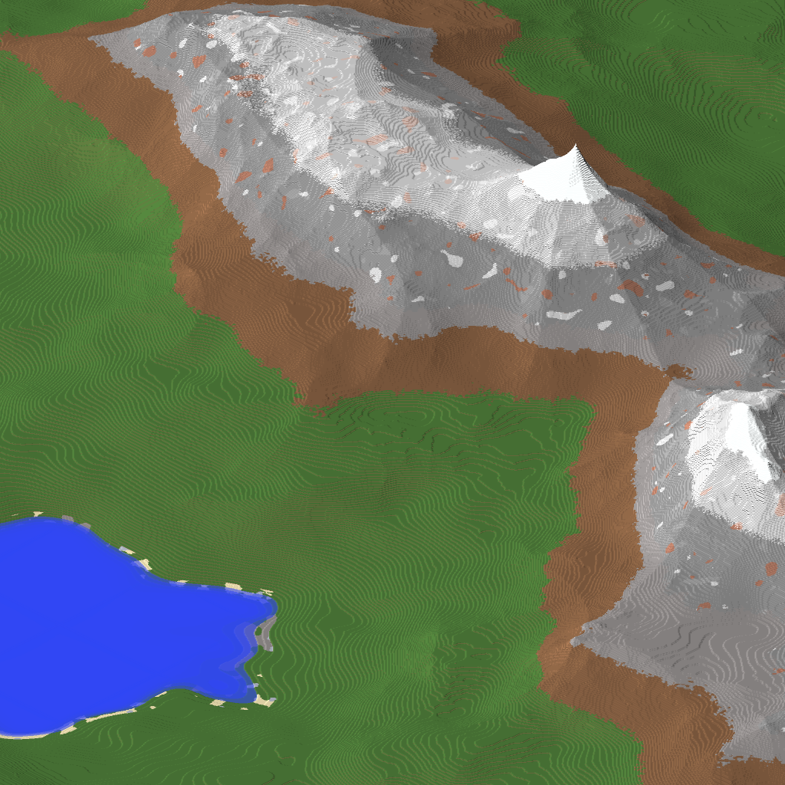

# HMG
C++ **H**eight **M**ap **G**enerator using FastNoise2 and OpenCL.</br>
HMG generates 16 Bit Grayscale HeightMaps, which you can use to generate Worlds in for example WorldPainter:
<details>
  
</details>

## Roadmap
- [x] Fractal Noise Generation with FastNoise2
- [x] Make Values like Width, Height, Seed and others Configurable
- [ ] Fade out towards Edges of the Heightmap, filling the Borders with 'Ocean'
- [ ] Implement Hydraulic Erosion using OpenCL

## Hydraulic Erosion Info
- ['Simulating hydraulic erosion' by Job Talle](https://jobtalle.com/simulating_hydraulic_erosion.html)
- [Hydraulic erosion in Unity by Sebastian Lague](https://www.youtube.com/watch?v=eaXk97ujbPQ)
- ['Fast Hydraulic Erosion Simulation and Visualization on GPU' by Xing Mei, Philippe Decaudin and Bao-Gang Hu](https://xing-mei.github.io/files/erosion.pdf)
- ['Implementation of a method for hydraulic erosion' by Hans Theobald Beyer](https://www.firespark.de/resources/downloads/implementation%20of%20a%20methode%20for%20hydraulic%20erosion.pdf)

## Used Libraries
- [FastNoise2](https://github.com/Auburn/FastNoise2)
- [libpng](https://github.com/glennrp/libpng)
- [zlib](https://github.com/madler/zlib)
- [OpenCL SDK](https://github.com/KhronosGroup/OpenCL-SDK)
- [cxxopts](https://github.com/jarro2783/cxxopts)

## Compilation
1. Create and Enter the Build Directory
```bash
mkdir build && cd build
```
2. Generate Makefile and Compile the Code
```bash
cmake .. && make
```
3. Run Executable
```bash
./HMG -h
Height Map Generator
Usage:
  HMG [OPTION...]

  -x, --width arg      HeightMap Width in Pixels (default: 4096)
  -y, --height arg     HeightMap Height in Pixels (default: 4096)
  -f, --frequency arg  FastNoise2 Frequency (default: 0.001)
  -s, --seed arg       FastNoise2 Seed (default: 1337)
  -n, --node arg       FastNoise2 Encoded Node String to use
  -o, --output arg     Output PNG File (default: noise.png)
  -h, --help           Print usage
```
